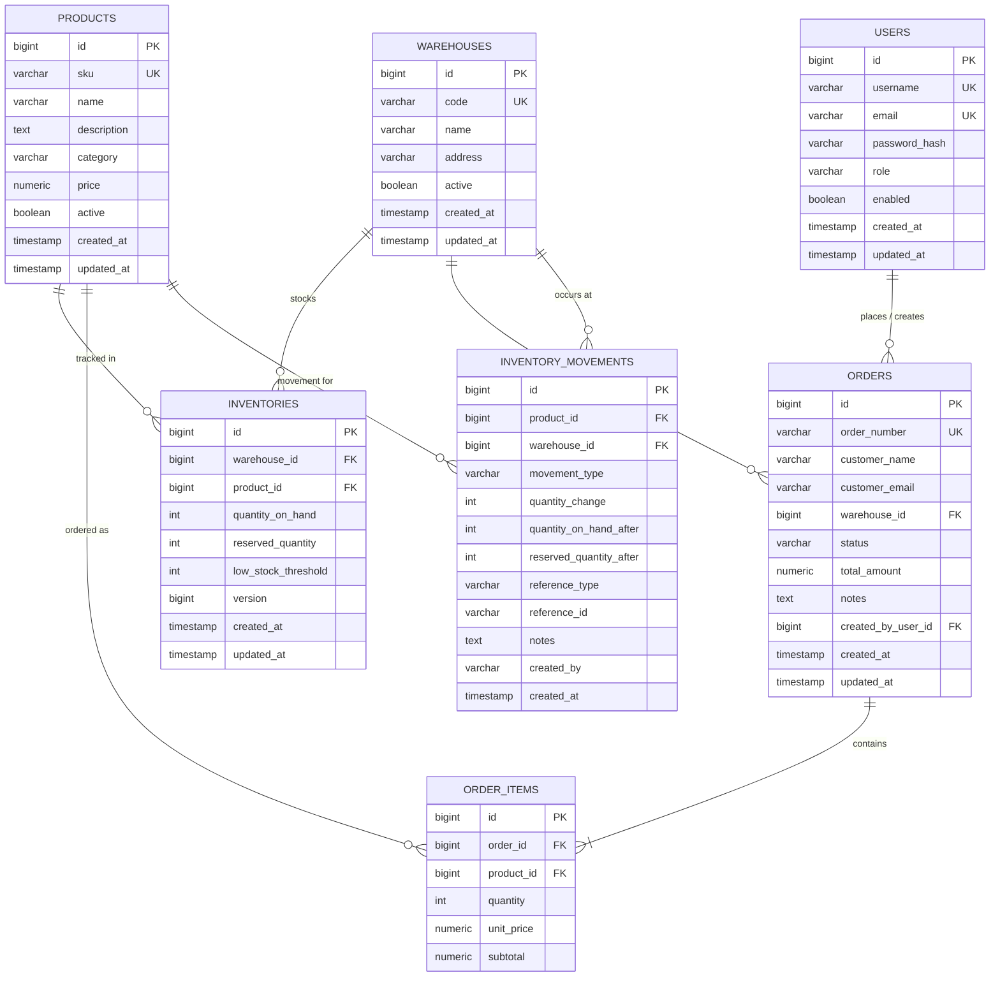
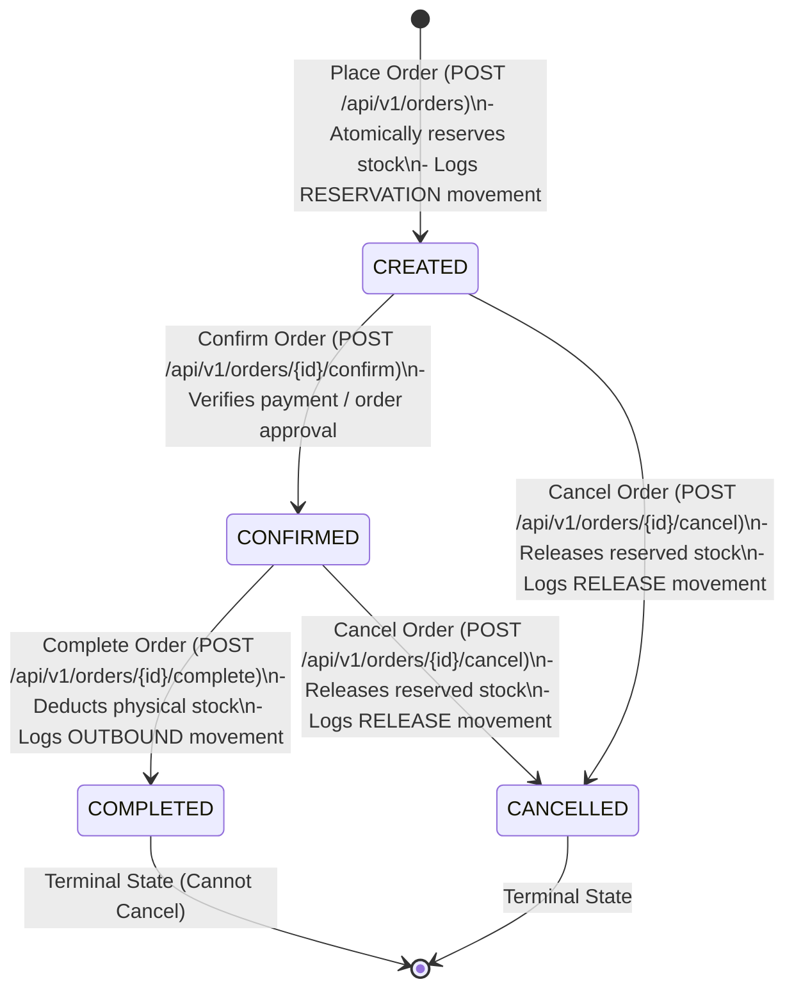

# StockFlow — Production-Grade Inventory & Order Management Backend

[](https://openjdk.org/projects/jdk/21/)
[](https://spring.io/projects/spring-boot)
[](https://www.postgresql.org/)
[](LICENSE)

StockFlow is a production-quality backend modular monolith engineered for multi-warehouse inventory tracking, thread-safe stock reservations, and order fulfillment. Designed to showcase enterprise-grade Java and Spring Boot practices, the project incorporates explicit transaction boundaries, strict concurrency controls, defense-in-depth database constraints, stateless JWT authentication with Role-Based Access Control (RBAC), Bean Validation, standardized RFC-compliant error envelopes, and an automated multi-threaded test suite.

---

## Table of Contents
- [Project Overview & Domain](#project-overview--domain)
- [Architecture & Package Structure](#architecture--package-structure)
- [System Architecture Diagrams](#system-architecture-diagrams)
- [Database Design & ER Diagram](#database-design--er-diagram)
- [Order Lifecycle State Machine](#order-lifecycle-state-machine)
- [Core Engineering Decisions](#core-engineering-decisions)
  - [Concurrency Control & Deadlock Prevention](#concurrency-control--deadlock-prevention)
  - [Transaction Boundaries](#transaction-boundaries)
  - [Authentication & Role-Based Authorization](#authentication--role-based-authorization)
  - [Audit Trail & Inventory Movements](#audit-trail--inventory-movements)
- [Technology Stack](#technology-stack)
- [Getting Started](#getting-started)
  - [Prerequisites](#prerequisites)
  - [Running Locally with Docker Compose](#running-locally-with-docker-compose)
  - [Running Tests](#running-tests)
- [Interactive API Documentation (Swagger / OpenAPI)](#interactive-api-documentation-swagger--openapi)
- [API Reference & Example Requests](#api-reference--example-requests)
- [Future Improvements](#future-improvements)

---

## Project Overview & Domain

In high-volume e-commerce and retail environments, inventory integrity is paramount. Common pitfalls include **overselling** (selling the same stock to multiple concurrent buyers), **stock leakage** (unreleased reservations from cancelled orders), and **database deadlocks** caused by multi-item orders locking inventory in non-deterministic order.

StockFlow addresses these real-world challenges with:
- **Separation of Stock States**: Differentiates between physical inventory (`quantityOnHand`), locked reservations (`reservedQuantity`), and real-time fulfillable stock (`availableQuantity = quantityOnHand - reservedQuantity`).
- **Multi-Warehouse Isolation**: Independent inventory tracking across multiple distribution hubs and fulfillment centers.
- **Atomic Order Lifecycle**: Validated state machine ensuring orders progress strictly through `CREATED` $\rightarrow$ `CONFIRMED` $\rightarrow$ `COMPLETED` (or `CANCELLED`), releasing or deducting stock atomically.
- **Audit Traceability**: Immutable event log recording every stock change with movement types (`INBOUND`, `OUTBOUND`, `RESERVATION`, `RELEASE`, `ADJUSTMENT`), before/after balances, and user attribution.

---

## Architecture & Package Structure

StockFlow is structured as a **clean, modular monolith**. Each domain is self-contained with cohesive entity, repository, service, DTO, and controller layers:

```
com.stockflow
├── common
│   ├── api/            # Generic ApiResponse<T> and PageResponse<T> envelopes
│   ├── entity/         # BaseEntity with automated JPA audit timestamps (createdAt, updatedAt)
│   └── exception/      # Domain exceptions and RFC-compliant GlobalExceptionHandler
├── config              # SecurityConfig, OpenApiConfig, JpaConfig, DataInitializer
├── security            # JwtService, JwtAuthenticationFilter, UserDetailsServiceImpl, SecurityUtils
├── user                # User entity, Role enum (ROLE_ADMIN, ROLE_STAFF), AuthController & DTOs
├── product             # Product catalog, dynamic specification filtering, ProductController
├── warehouse           # Warehouse facilities management, WarehouseController
├── inventory           # Inventory, InventoryMovement audit log, InventoryController
└── order               # Order, OrderItem, OrderStatus state machine, OrderController
```

---

## System Architecture Diagrams

### High-Level Architecture

```mermaid
graph TD
    Client[Client / Frontend / Postman] -->|HTTP REST / Bearer JWT| SecurityFilter[JwtAuthenticationFilter]
    SecurityFilter --> SecurityContext[Spring Security Context]
    SecurityContext --> Controllers[REST Controllers]
    
    subgraph ControllersLayer [Controller Layer]
        AuthController[AuthController]
        ProductController[ProductController]
        WarehouseController[WarehouseController]
        InventoryController[InventoryController]
        OrderController[OrderController]
    end
    
    ControllersLayer --> ServicesLayer [Service Layer - Transaction Boundaries]
    
    subgraph ServicesLayer [Service Layer]
        UserService[UserService]
        ProductService[ProductService]
        WarehouseService[WarehouseService]
        InventoryService[InventoryService - Row Locks]
        OrderService[OrderService - Atomic Workflow]
    end
    
    ServicesLayer --> RepositoriesLayer [Spring Data JPA Repositories]
    
    subgraph Storage [Database Layer]
        PostgreSQL[(PostgreSQL 16 Engine)]
    end
    
    RepositoriesLayer --> PostgreSQL
```

---

## Database Design & ER Diagram

The relational schema is normalized to Third Normal Form (3NF) with foreign keys, composite unique constraints, and high-performance indexes:



### Strategic Indexes
- **`products(sku)`**: Unique B-tree index for instantaneous SKU resolution.
- **`products(category, active)`**: Composite index accelerating catalog queries.
- **`inventories(warehouse_id, product_id)`**: Composite unique index powering row-level lookups and locking.
- **`orders(warehouse_id, status)`**: Composite index optimizing warehouse dispatch dashboards.
- **`orders(customer_email)`**: Index for customer order history queries.
- **`inventory_movements(created_at DESC)`**: Index optimizing audit and chronological reporting.

---

## Order Lifecycle State Machine



---

## Core Engineering Decisions

### Concurrency Control & Deadlock Prevention

#### The Problem
When multiple users attempt to purchase the last remaining stock of a hot item simultaneously, standard read-check-update logic causes **lost updates** and **negative inventory** (overselling). Furthermore, when orders contain multiple items (e.g. Order 1 needs Products [A, B] while Order 2 needs Products [B, A]), acquiring locks in arbitrary sequence leads to **database deadlocks**.

#### The Solution: Pessimistic Row Locking + Deterministic Sorting
StockFlow implements a two-tier concurrency defense:

1. **Pessimistic Write Locking (`PESSIMISTIC_WRITE`)**:
   ```java
   @Lock(LockModeType.PESSIMISTIC_WRITE)
   @Query("SELECT i FROM Inventory i WHERE i.warehouse.id = :warehouseId AND i.product.id = :productId")
   Optional<Inventory> findByWarehouseIdAndProductIdWithLock(@Param("warehouseId") Long warehouseId, @Param("productId") Long productId);
   ```
   - Translates to `SELECT ... FOR UPDATE` in PostgreSQL.
   - Serializes concurrent transactions targeting the same warehouse-product pair without the high rollback penalty of optimistic locking under heavy contention.
   - Any transaction acquiring the lock reads the freshly committed stock balance. If available units fall below the requested count, it immediately throws `InsufficientStockException` and rolls back cleanly.

2. **Deadlock Prevention via Canonical Sorting**:
   - Before acquiring row locks in multi-item orders, the items are deterministically sorted by `productId ASC`:
   ```java
   List<OrderItemRequest> sortedItems = request.getItems().stream()
           .sorted(Comparator.comparing(OrderItemRequest::getProductId))
           .toList();
   ```
   - Guaranteeing a single global lock acquisition order across all threads prevents cyclic lock dependency, mathematically eliminating deadlocks.

3. **Defense-in-Depth (Optimistic `@Version` + DB Invariants)**:
   - An `@Version` field on `Inventory` protects non-locked bulk updates.
   - Application domain guards ensure `quantityOnHand >= reservedQuantity` and `availableQuantity >= 0`.

---

### Transaction Boundaries

StockFlow applies `@Transactional` with strict discipline at the service layer:
- **`OrderService.createOrder`**: Atomic transaction orchestrating warehouse validation, item sorting, pessimistic inventory locking, stock reservation, audit movement recording, and order persistence.
- **`OrderService.completeOrder`**: Atomic transaction updating order status to `COMPLETED` and deducting physical stock with `OUTBOUND` audit logging.
- **`OrderService.cancelOrder`**: Atomic transaction releasing reserved stock back to `availableQuantity` and logging `RELEASE` movements.
- **`InventoryService.adjustStock`**: Atomic transaction managing manual adjustments and audit trails.
- **Read-Only Queries**: Explicitly annotated with `@Transactional(readOnly = true)` to optimize Hibernate dirty checking and database connection pool transactions.
- **Controllers**: Strictly non-transactional, preventing extended open connection holding during network I/O or serialization.

---

### Authentication & Role-Based Authorization

Authentication utilizes stateless **JSON Web Tokens (JWT)**:
- Passwords are encrypted using **BCrypt** with salted hashing.
- Every API request is verified through `JwtAuthenticationFilter`.
- Endpoints enforce Role-Based Access Control (RBAC):
  - `ROLE_ADMIN`: Full administrative control, including product creation, updates, deactivation, warehouse management, and stock adjustments.
  - `ROLE_STAFF`: Catalog querying, inventory viewing, order placement, lifecycle state progression, and stock adjustments with audit notes.
  - Public: Registration (`/api/v1/auth/register`), Login (`/api/v1/auth/login`), Swagger UI (`/swagger-ui/**`), and OpenAPI specification (`/v3/api-docs/**`).

---

### Audit Trail & Inventory Movements

To satisfy audit compliance and supply chain forensics, every inventory mutation records an immutable `InventoryMovement`:
- `movementType`: `INBOUND`, `OUTBOUND`, `RESERVATION`, `RELEASE`, `ADJUSTMENT`.
- `quantityChange`: Signed integer delta.
- `quantityOnHandAfter` & `reservedQuantityAfter`: Point-in-time stock snapshots.
- `referenceType` & `referenceId`: Linked order number or adjustment justification.
- `createdBy`: Username of the authenticated actor.

---

## Technology Stack

| Layer | Technology | Rationale |
|---|---|---|
| **Language** | Java 21 LTS | Modern language features (Pattern Matching, Records, Virtual Threads ready) |
| **Framework** | Spring Boot 3.3.4 | Industry standard, robust dependency injection and production ecosystem |
| **Data Access** | Spring Data JPA / Hibernate 6 | Type-safe persistence with optimized dynamic specifications |
| **Primary Database** | PostgreSQL 16 | ACID-compliant relational engine with robust row-level locking |
| **Test Database** | H2 (PostgreSQL Mode) | Fast, isolated, zero-dependency in-memory execution for CI/CD |
| **Security** | Spring Security 6 + JJWT 0.12 | Stateless token-based security and method-level authorization |
| **Validation** | Jakarta Bean Validation | Declarative request payload validation |
| **API Documentation** | SpringDoc OpenAPI 3 (Swagger UI) | Interactive, self-documenting REST APIs |
| **Build Tool** | Apache Maven 3.9+ | Standardized lifecycle and dependency management |

---

## Getting Started

### Prerequisites
- **Java 21 JDK** installed
- **Apache Maven 3.9+** installed
- **Docker & Docker Compose** (for running PostgreSQL locally)

### Running Locally with Docker Compose

1. **Start PostgreSQL**:
   ```bash
   docker compose up -d
   ```

2. **Run the Application**:
   ```bash
   mvn spring-boot:run
   ```

3. The application starts on `http://localhost:8080`.
   Default seed credentials generated automatically:
   - **Admin Account**: `admin` / `Admin@12345`
   - **Staff Account**: `staff` / `Staff@12345`

### Running Tests

Execute the complete test suite (46 unit and integration tests, including the multithreaded concurrency test):
```bash
mvn test
```

---

## Interactive API Documentation (Swagger / OpenAPI)

Once the application is running, open the interactive Swagger UI in your browser:
- **Swagger UI**: [http://localhost:8080/swagger-ui.html](http://localhost:8080/swagger-ui.html)
- **OpenAPI 3 JSON Spec**: [http://localhost:8080/v3/api-docs](http://localhost:8080/v3/api-docs)

To authenticate in Swagger UI:
1. Click the green **Authorize** button in the top right.
2. Enter your JWT token from `/api/v1/auth/login`.

---

## API Reference & Example Requests

### 1. Authentication

#### Register User
```bash
curl -X POST http://localhost:8080/api/v1/auth/register \
  -H "Content-Type: application/json" \
  -d '{
    "username": "sarah_staff",
    "email": "sarah@stockflow.internal",
    "password": "Password@123",
    "role": "ROLE_STAFF",
    "firstName": "Sarah",
    "lastName": "Connor"
  }'
```

#### Login
```bash
curl -X POST http://localhost:8080/api/v1/auth/login \
  -H "Content-Type: application/json" \
  -d '{
    "username": "admin",
    "password": "Admin@12345"
  }'
```

*Response:*
```json
{
  "success": true,
  "message": "Login successful",
  "data": {
    "token": "eyJhbGciOiJIUzI1NiIsInR5cCI6IkpXVCJ9...",
    "tokenType": "Bearer",
    "userId": 1,
    "username": "admin",
    "email": "admin@stockflow.internal",
    "role": "ROLE_ADMIN",
    "expiresInMs": 86400000
  },
  "timestamp": "2026-09-03T13:40:00Z"
}
```

---

### 2. Product Management

#### Create Product (Admin Only)
```bash
curl -X POST http://localhost:8080/api/v1/products \
  -H "Authorization: Bearer <TOKEN>" \
  -H "Content-Type: application/json" \
  -d '{
    "sku": "PROD-HEADSET-01",
    "name": "Noise Cancelling Headphones",
    "description": "Premium wireless ANC headphones",
    "category": "Audio",
    "price": 299.99
  }'
```

#### Search & Filter Products
```bash
curl -X GET "http://localhost:8080/api/v1/products?category=Audio&maxPrice=350&page=0&size=10" \
  -H "Authorization: Bearer <TOKEN>"
```

---

### 3. Inventory & Stock Adjustments

#### Inbound Stock Adjustment (Restock)
```bash
curl -X POST http://localhost:8080/api/v1/inventory/adjust \
  -H "Authorization: Bearer <TOKEN>" \
  -H "Content-Type: application/json" \
  -d '{
    "warehouseId": 1,
    "productId": 1,
    "quantityChange": 50,
    "movementType": "INBOUND",
    "notes": "Shipment PO-9082 received from supplier"
  }'
```

#### Query Low-Stock Report
```bash
curl -X GET "http://localhost:8080/api/v1/inventory/low-stock?warehouseId=1" \
  -H "Authorization: Bearer <TOKEN>"
```

#### Query Movement Audit History
```bash
curl -X GET "http://localhost:8080/api/v1/inventory/movements?warehouseId=1&productId=1" \
  -H "Authorization: Bearer <TOKEN>"
```

---

### 4. Orders & Fulfillment Lifecycle

#### Create Order (Reserves Inventory Atomically)
```bash
curl -X POST http://localhost:8080/api/v1/orders \
  -H "Authorization: Bearer <TOKEN>" \
  -H "Content-Type: application/json" \
  -d '{
    "customerName": "Alice Johnson",
    "customerEmail": "alice.johnson@example.com",
    "warehouseId": 1,
    "notes": "Please deliver before 5 PM",
    "items": [
      {
        "productId": 1,
        "quantity": 2
      },
      {
        "productId": 2,
        "quantity": 1
      }
    ]
  }'
```

#### Confirm Order
```bash
curl -X POST http://localhost:8080/api/v1/orders/1/confirm \
  -H "Authorization: Bearer <TOKEN>"
```

#### Complete Order (Deducts Physical Stock)
```bash
curl -X POST http://localhost:8080/api/v1/orders/1/complete \
  -H "Authorization: Bearer <TOKEN>"
```

#### Cancel Order (Releases Reserved Stock)
```bash
curl -X POST http://localhost:8080/api/v1/orders/1/cancel \
  -H "Authorization: Bearer <TOKEN>"
```

---

## Future Improvements

While StockFlow is built with production rigor as a clean modular monolith, several architectural enhancements can be explored for extreme scale:
- **Inter-Warehouse Transfers**: Dedicated transfer workflows for balancing stock distribution across facilities.
- **Stock Reservation TTL / Expiry Jobs**: Automated background scheduled workers (`@Scheduled`) to auto-cancel abandoned unpaid orders after 15 minutes and release reserved inventory.
- **Outbox Pattern for External Integrations**: When integrating with external third-party logistics (3PL) or billing providers, implementing an outbox table with transactional commit guarantees zero event loss.
- **Asynchronous Event Publishing**: Introducing Spring Application Events (`@TransactionalEventListener`) to decouple non-critical tasks (such as email receipt notifications) from the primary database transaction.
